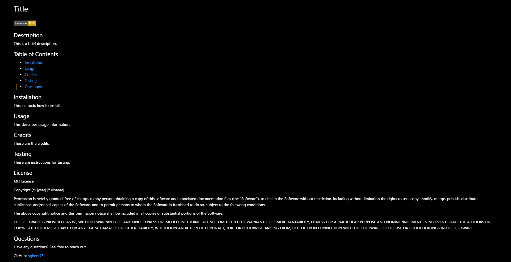

# ch09-READMEgen

## Table of Contents

* [Description](#description)
* [Usage](#usage)
* [Credit](#credit)
* [Criteria](#criteria)
* [Questions](#questions)

## Description
This project is a README generator. It's a commandline-based application that prompts you with different sections of your README for you to fill in the information. After completing the prompts, an organized README with a license badge, organized table of contents, divided sections with the information you inputted, and links to your GitHub and email will generate.

```md
AS A developer
I WANT a README generator
SO THAT I can quickly create a professional README for a new project
```

## Usage

To access the repo, go to https://github.com/ngkent75/ch09-READMEgen


1. Open up your terminal in the assets folder.
2. Type node index.js to begin the application.
3. Fill in relevant information as prompted in the terminal, pressing enter to continue to the next prompt.
4. Once you answer all the prompts, the application will end and your README file will be generated.
5. You can run the application again with different prompt inputs to edit the README file.

Your README should look something like this:



## Credit

Markdown documentation: https://guides.github.com/features/mastering-markdown/#syntax

Inquirer documentation: https://www.npmjs.com/package/inquirer

Licensing information: https://choosealicense.com/

License badges: https://gist.github.com/lukas-h/2a5d00690736b4c3a7ba

Recording software: https://www.screencastify.com/

## Criteria

```md
GIVEN a command-line application that accepts user input
WHEN I am prompted for information about my application repository
THEN a high-quality, professional README.md is generated with the title of my project and sections entitled Description, Table of Contents, Installation, Usage, License, Contributing, Tests, and Questions
WHEN I enter my project title
THEN this is displayed as the title of the README
WHEN I enter a description, installation instructions, usage information, contribution guidelines, and test instructions
THEN this information is added to the sections of the README entitled Description, Installation, Usage, Contributing, and Tests
WHEN I choose a license for my application from a list of options
THEN a badge for that license is added near the top of the README and a notice is added to the section of the README entitled License that explains which license the application is covered under
WHEN I enter my GitHub username
THEN this is added to the section of the README entitled Questions, with a link to my GitHub profile
WHEN I enter my email address
THEN this is added to the section of the README entitled Questions, with instructions on how to reach me with additional questions
WHEN I click on the links in the Table of Contents
THEN I am taken to the corresponding section of the README
```


## Questions
Have any questions? Feel free to reach out.

GitHub: [ngkent75](https://github.com/ngkent75)

Email: [ngkent75@gmail.com](mailto:ngkent75@gmail.com)